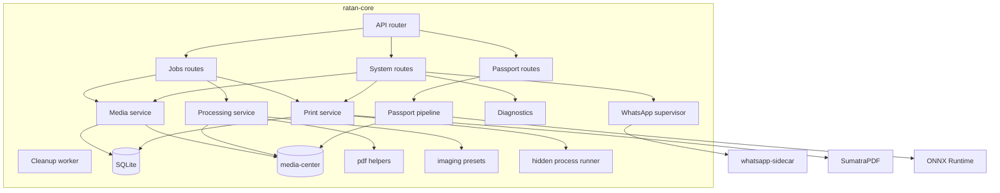
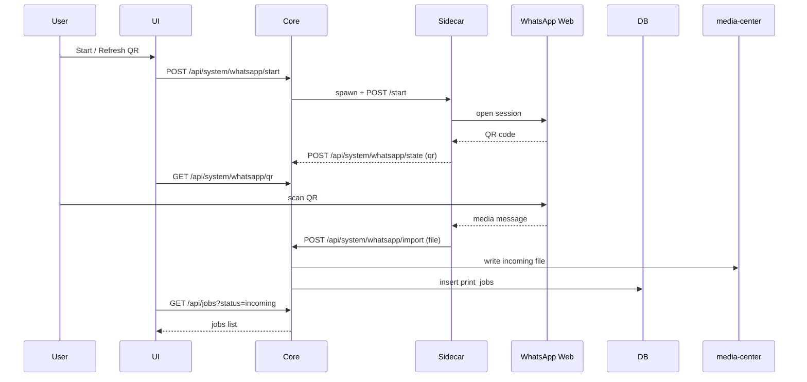
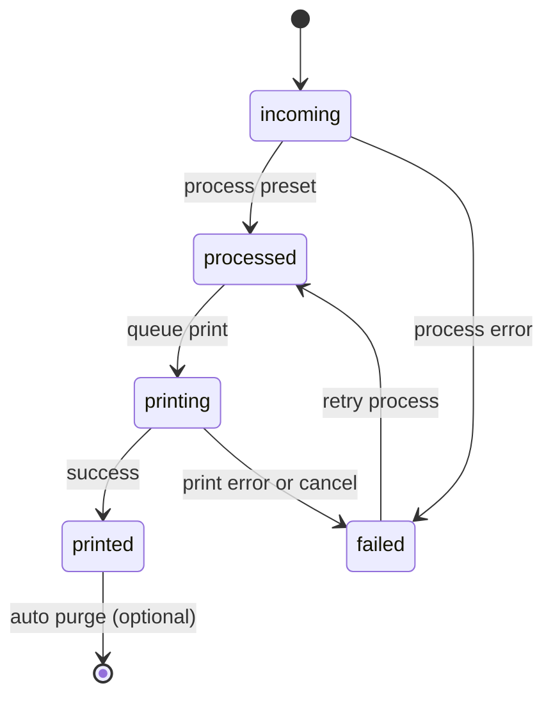
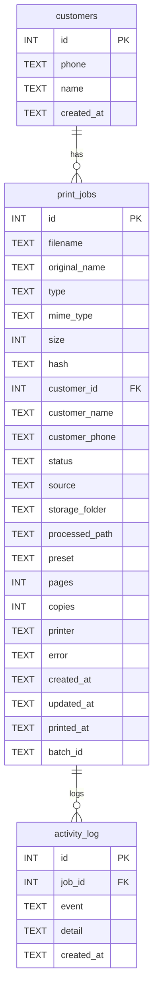

# Ratan - Cyber Cafe Print Automation

WhatsApp -> Media Center -> One-Click Print, built per [plan.md](./plan.md) with the [Agilify](./design.md) design system.

## What runs in production
Ratan ships as a Windows desktop app built with Tauri. The app bundles:
- ratan-core (Rust HTTP API on 127.0.0.1:5000)
- Next.js UI (static export in frontend/out) rendered in WebView
- WhatsApp sidecar (whatsapp-sidecar.exe) using whatsapp-web.js + puppeteer-core
- SumatraPDF.exe print engine
- ONNX models for passport pipeline
- Local data: media-center and SQLite database

The legacy Express backend in backend/ is kept for reference and parity, but the desktop app uses ratan-core.

## Repo layout

```
crates/ratan-core/  Rust backend (axum API, processing, print queue)
src-tauri/          Tauri shell (desktop app, updater)
frontend/           Next.js UI (App Router, static export for Tauri)
whatsapp-sidecar/   Node sidecar for WhatsApp Web automation
media-center/       Local file storage (incoming/processed/printed/failed/temp)
backend/            Legacy Express backend (reference)
```

## User workflow (operator)
1. Link WhatsApp once by scanning the QR in the UI.
2. Customer sends JPG/PNG/PDF/DOCX to the linked WhatsApp number.
3. The sidecar imports the media; ratan-core stores it in media-center/incoming and creates a job.
4. The dashboard shows incoming jobs (auto-refresh).
5. Operator selects jobs, chooses a preset, and processes to PDF.
6. Operator selects printer and copies, then prints.
7. Printed files are copied to media-center/printed and the job is marked printed.

Manual upload is supported from the UI.

## Instructions

### Prerequisites
- Windows 10/11
- Node.js 18+ (frontend and sidecar)
- Rust (MSVC toolchain) + Visual C++ Build Tools
- WebView2 runtime (Windows 11 includes it)
- A default Windows printer
- Chrome or Edge installed (WhatsApp automation uses Chromium)

### Install

```powershell
npm install
npm --prefix frontend install
npm --prefix whatsapp-sidecar install
```

Optional (legacy backend only):

```powershell
npm --prefix backend install
```

### Run (dev - Rust core + Next dev)

```powershell
# terminal 1
cargo run -p ratan-core --bin ratan-server

# terminal 2
npm --prefix frontend run dev
```

- API: http://127.0.0.1:5000
- UI: http://localhost:4500 (proxies /api -> 5000)

To skip WhatsApp during UI work:

```powershell
$env:WHATSAPP_ENABLED = "false"
```

### Run (dev - Tauri shell)

```powershell
npx tauri dev
```

This runs the UI and the Rust backend inside the desktop shell.

### Build installer (local)

```powershell
$env:PUPPETEER_SKIP_DOWNLOAD = "true"
npm --prefix whatsapp-sidecar install
npm --prefix whatsapp-sidecar run package

# Put SumatraPDF.exe in dist/ (the release workflow downloads it automatically)
npx tauri build
```

### Release to GitHub (auto-updater)
1. Generate updater signing keys (one time):
	 ```powershell
	 npx tauri signer generate -w $HOME/.tauri/ratan.key
	 ```
2. Put the public key in src-tauri/tauri.conf.json -> plugins.updater.pubkey.
3. Set GitHub secrets:
	 - TAURI_SIGNING_PRIVATE_KEY (contents of the private key file)
	 - TAURI_SIGNING_PRIVATE_KEY_PASSWORD
4. Bump versions in Cargo.toml and src-tauri/tauri.conf.json.
5. Tag and push:
	 ```powershell
	 git tag v0.1.3
	 git push origin v0.1.3
	 ```

### Data locations
- Dev: media-center/ and backend/data/ratan.db under the repo root.
- Packaged app: %LOCALAPPDATA%\com.ratan.app\ (media-center, data/ratan.db, wwebjs_auth).

### Configuration (env vars)
- PORT (default 5000)
- MEDIA_ROOT (default ./media-center)
- DB_PATH (default ./backend/data/ratan.db)
- WHATSAPP_ENABLED (default true)
- ALLOWED_ORIGIN (default http://localhost:4500)
- PRINTED_RETENTION_MINUTES (default 120, 0 disables cleanup)
- CLEANUP_INTERVAL_MINUTES (default 10)
- MODNET_ONNX, FACE_ONNX (passport models)
- RATAN_RESOURCE_DIR (location of SumatraPDF.exe and models in packaged app)
- WA_SESSION_DIR (WhatsApp LocalAuth storage)
- WA_SIDECAR_PATH (packaged sidecar exe)
- WA_SIDECAR_SCRIPT (dev sidecar script)
- WA_SIDECAR_PORT (default 5099)
- CHROME_PATH (optional override in sidecar)

## Architecture (HLD)

### System flow

```mermaid
flowchart LR
	customer[Customer] --> wa[WhatsApp]
	wa --> sidecar[WhatsApp sidecar]
	sidecar --> api[ratan-core API :5000]
	ui[Desktop UI (Next.js)] <--> api
	api --> media[(media-center folders)]
	api --> db[(SQLite ratan.db)]
	api --> queue[Print queue]
	queue --> sumatra[SumatraPDF]
	sumatra --> printer[Windows printer]
```

### Deployment view

```mermaid
flowchart TB
	subgraph PC[Windows PC]
		subgraph App[Ratan.exe (Tauri)]
			ui[WebView UI]
			core[ratan-core API]
			side[whatsapp-sidecar.exe]
			sumatra[SumatraPDF.exe]
			models[ONNX models]
		end
		media[(media-center)]
		db[(SQLite ratan.db)]
		printer[Windows printer]
	end

	wa[WhatsApp Web]
	user[Operator phone]
	user --> wa
	wa --> side
	ui <--> core
	side <--> core
	core --> media
	core --> db
	core --> sumatra
	sumatra --> printer
```

## Low level design (LLD)

### Component map



### WhatsApp import sequence



### Job state machine



### Data model (ERD)



## Key behaviors (code level)
- Ingestion filters extensions, hashes content, and deduplicates by SHA-256 before inserting a job.
- Images from the same customer within 10 seconds share a batch_id for batch actions.
- Processing presets render images to A4 PDFs; PDFs are copied and page-counted.
- Merge combines processed PDFs into a new job (status processed, preset merge).
- Print queue is serialized in memory; jobs move to printing then printed or failed.
- Cleanup auto-purges printed jobs after PRINTED_RETENTION_MINUTES.
- Passport pipeline uses MODNet for matting and UltraFace for face alignment with graceful fallback when models are missing.

## API surface (ratan-core, port 5000)

| Method | Path | Purpose |
|---|---|---|
| GET | /api/health | Liveness |
| GET | /api/jobs | List jobs (status, limit, offset) |
| GET | /api/jobs/counts | Status counts |
| GET | /api/jobs/:id | One job |
| GET | /api/jobs/:id/file?processed=1 | Stream original or processed file |
| POST | /api/jobs/upload | Multipart upload (manual import) |
| POST | /api/jobs/merge | Merge multiple jobs into one PDF |
| POST | /api/jobs/:id/process | { preset } render to PDF |
| POST | /api/jobs/:id/print | { printer, copies, orientation, paperSize, grayscale } |
| POST | /api/jobs/batch/:batch_id/process | Process all jobs in a batch |
| POST | /api/jobs/batch/:batch_id/print | Print all jobs in a batch |
| DELETE | /api/jobs/:id | Remove job + files |
| DELETE | /api/jobs/batch/:batch_id | Remove batch jobs + files |
| DELETE | /api/jobs?status=incoming | Bulk delete by status |
| GET | /api/system/status | WhatsApp state, counts, presets, queue |
| GET | /api/system/whatsapp/qr | Current QR data URL + status |
| POST | /api/system/whatsapp/start | Start / restart WhatsApp client |
| POST | /api/system/whatsapp/state | Sidecar push (internal) |
| POST | /api/system/whatsapp/import | Sidecar import (internal) |
| GET | /api/system/printers | List installed Windows printers |
| POST | /api/system/cancel | Clear queue and cancel printing |
| GET | /api/system/activity?limit=25 | Recent activity feed |
| GET | /api/system/diagnostics | Health report |
| GET | /api/passport/status | Passport pipeline status |
| POST | /api/passport/prepare | Multipart image -> preview |
| POST | /api/passport/prepare-job | Prepare from existing job |
| GET | /api/passport/prepared/:id | Preview PNG |
| POST | /api/passport/sheet | Create 3x3 sheet PDF |

## Diagnostics and maintenance
- /api/system/diagnostics runs checks for media folders, database, print engine, printers, browser, and WhatsApp state.
- Cleanup job runs every CLEANUP_INTERVAL_MINUTES and purges printed jobs older than PRINTED_RETENTION_MINUTES.

## Design system
frontend/src/app/globals.css holds all CSS variables from [design.md](./design.md). tailwind.config.js re-exposes them as Tailwind tokens (for example bg-bg-app, text-text-primary, rounded-pill, shadow-card).

Cards, tags, badges, and the activity sidebar match the Agilify spec: same radii, same shadows, same date badge color semantics (pink = overdue, yellow = today, green = future).

## What this build covers (MVP, plan.md section "MVP Scope")

- [x] Automatic WhatsApp import (whatsapp-web.js + LocalAuth)
- [x] Local media center with SHA-256 dedup, safe-extension filter
- [x] Browser dashboard (Incoming / Processed / Printed / Queue / Failed)
- [x] File preview (image + PDF) in panel
- [x] Image enhancement presets (Scan PDF / B&W / Color / High Contrast / Passport / A4)
- [x] One-click print via local print agent (SumatraPDF)
- [x] Activity feed sidebar

Excluded (future, per plan.md): OCR, billing, AI enhancement, cloud sync, customer portal.
